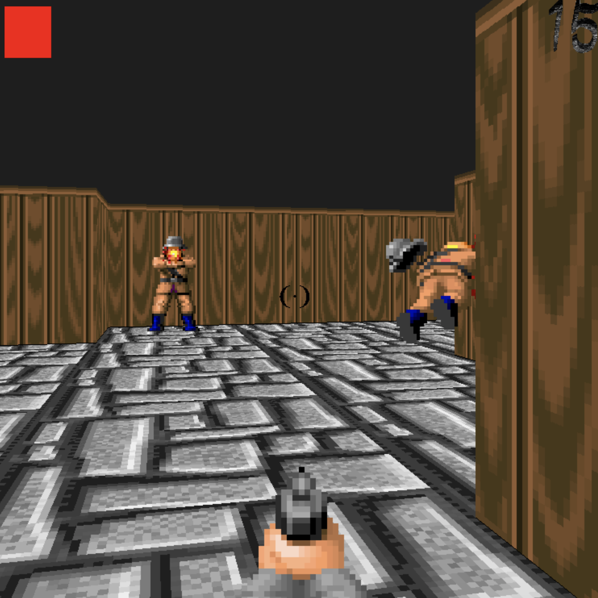

# cub-strike
3D Shooter on pure C language, based on raycasting



# Repository
---
C language
---
```
Game made in opengl library, using raycasting technology to make it pseudo 2d.

After adding ability to rotating camera in any direction, it got pseudo 3d view.
```
# Compile

>only for MacOs 

`make` 

# Run

## Singeplayer

`./cubstrike3D maps/startgame.cub`

To run specific lvl

`./cubstrike3D (path to your lvl)`

## Multiplayer

### Host

`./cubstrike3D maps/startgame.cub host 5600`

To host game with specific map or port

`./cubstrike3D (path to your lvl) host (port)`

### Connect to host

`./cubstrike3D maps/startgame.cub client 127.0.0.1 5600`

To connect to host with specific map, ip, or port

`./cubstrike3D (map) client (ip) (port)`
> Port should be same, that in hosted game

>---
>
> You can run with --save to take first frame as screenshot
>
>---

# Controls

* `WASD` Move
* `Mouse` Rotate camera
* `Space` Shoot

# Custom maps

All maps stored in `./maps/`

## Map main properties

| Key  | Explanation |
| ------------- |:-------------:|
| R      | Resolution     |
| NO      | Path to north texture     |
| SO      | Path to south texture     |
| EA      | Path to eath texture     |
| WE      | Path to weast texture     |
| EG      | Path to portal texture     |
| FL      | Path to floor texture     |
| NEXTLEVEL      | Path to next level     |

## Map
| Key  | Explanation |
| ------------- |:-------------:|
| 0      | Empty space     |
| 1      | Wall     |
| 2      | Enemy     |
| 3      | Portal to next level     |
| 4      | Health     |
